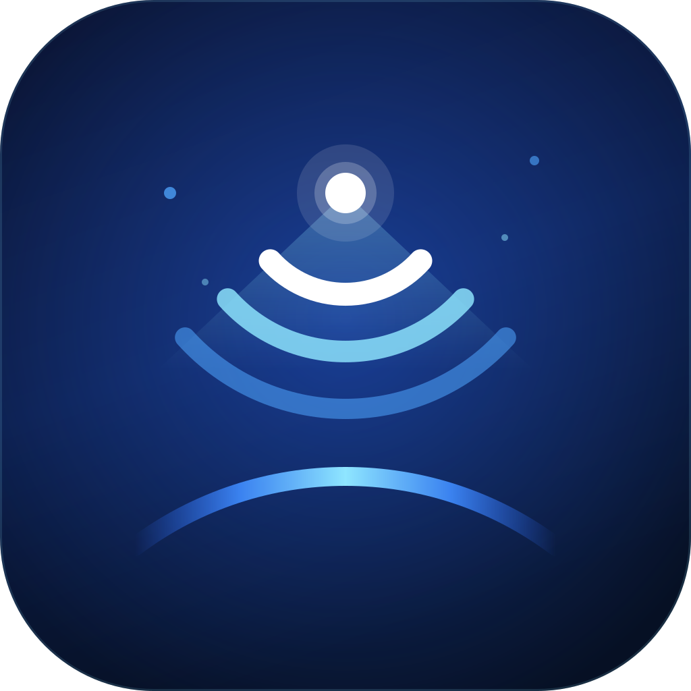

# Logo — App Starlink

Marca original (desenhada em vetor aqui, **não** é a logo oficial da SpaceX/Starlink).
Conceito: um satélite em órbita emitindo feixe e ondas de sinal sobre a curvatura da Terra.

## Arquivos

| Arquivo | Uso |
|---|---|
| `icon-1024.png` … `icon-16.png` | Ícone do app (fundo escuro, cantos arredondados). 1024 p/ App Store, 512/192 p/ PWA, 180 p/ apple-touch-icon |
| `favicon.ico` | Favicon multi-resolução (16→256) |
| `mark-light-1024.png` / `-512` | Só a marca, fundo transparente — para fundos **escuros** |
| `mark-dark-1024.png` / `-512` | Só a marca, fundo transparente — para fundos **claros** |
| `lockup-light-1160.png` | Marca + wordmark horizontal, para fundos escuros |
| `lockup-dark-1160.png` | Marca + wordmark horizontal, para fundos claros |
| `*.svg` | Fontes vetoriais — reexporte em qualquer tamanho sem perda |

## Paleta

| Token | Hex |
|---|---|
| Space navy (topo do fundo) | `#0A1330` |
| Deep blue (base do fundo) | `#061024` |
| Signal cyan | `#8FE6FF` |
| Orbit blue | `#4FA6FF` |
| Ink (versão clara) | `#0B1C46` |
| Accent (versão clara) | `#1B4DD8` |

## Reexportar PNG a partir do SVG

```bash
CHROME=/opt/pw-browsers/chromium-1194/chrome-linux/chrome   # ou o Chrome local
cat > /tmp/p.html <<'HTML'
<style>html,body{margin:0}img{display:block;width:2048px;height:2048px}</style>

HTML
"$CHROME" --headless --default-background-color=00000000 --window-size=2048,2048 \
  --screenshot=icon-2048.png file:///tmp/p.html
```

## Nota de marca

`STARLINK` é marca registrada da SpaceX. O wordmark do lockup está aqui só como
placeholder — se o app for de terceiros, troque pelo nome próprio do produto
(ex.: "Dishy Monitor", "OrbitLink") e use "for Starlink" apenas como descritivo.
É só editar o `<text>` dentro de `lockup-*.svg` e reexportar.
